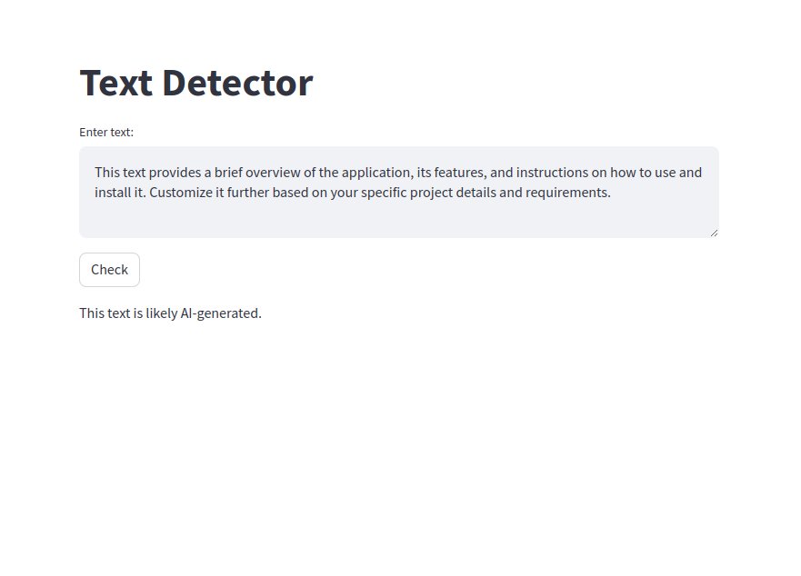

The Text Detector program is a web application that leverages the GPT-2 machine learning model to determine if a block of text is likely generated by AI or written by a human. It offers a simple and interactive user interface built with Streamlit, where users can input text into a designated area. The user then submits the text for analysis by pressing the "Check" button.

Behind the scenes, the program uses a function that taps into the capabilities of the GPT-2 model provided by the Hugging Face Transformers library to generate new text based on the user's input. It compares the newly generated text with the input: if there's a match, it suggests that the text could be AI-generated; otherwise, it's likely to be human-written.

Once the analysis is completed, the program displays the results on the same web page, giving users an instant determination of the nature of their text. This tool serves as a handy resource for anyone looking to differentiate between human and AI-authored content.
https://huggingface.co/spaces/razaAhmed/TextDetector